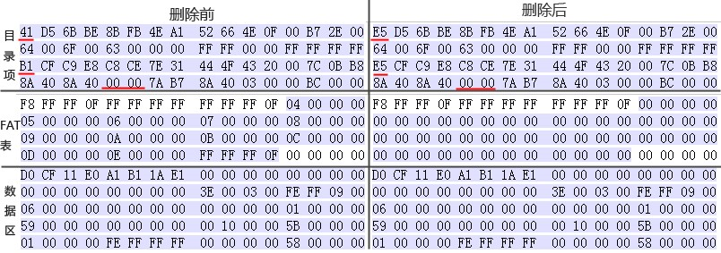
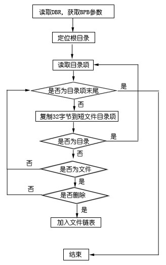
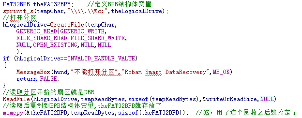
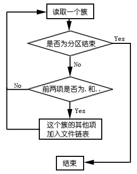

#FAT32文件系统文件恢复

##FAT32文件系统文件删除的分析

首先在分区下创建一个文件，记录下其目录项、FAT表、数据区，然后删除这个文件，再取这几个区域的值和未删除前的对比，如图。



由表对比可知，FAT32文件系统下删除一个文件只在三个地方做改变，第一个地方是对应目录项的第一个字节改成“5E”标志，这个标志是表示删除的目录项；第二个地方是目录项的文件起始簇号高位的两个字节被清零，在示例中高位本来就为0000，删除后也是0000，看不到变化，其实是已经被清零了；第三个地方就是FAT表中对应簇的值被清零，表示这些簇被释放。目录项的其他数据是没有改变的，数据区的数据毫发无损，正是基于这个原因，只要数据区的未被覆盖，简单删除的文件是可以恢复的。

##文件删除后恢复算法及实现
FAT32文件系统下删除文件，根据其特征，思路如下：定位DBR，读取分区参数，再定位根目录，从第一个目录项开始，按照删除文件特征“5E”查找删除的项，如果是删除的文件，读取删除文件的属性，并加入文件树链表；如果是目录，则递归查找这个目录，和根目录一样处理，查找完这个目录则把查找到的项加入文件链表，再返回根目录。最后到根目录的结束整个查找过程也完成了。具体流程图如图所示。



只要有了思路，编程实现就比较容易了。
读取BPB使用了一个结构体来辅助，具体结构如下：
```
//FAT32的BPB
typedef struct{
	BYTE NoUsed[11];				//为了后面好编程，保留这11个字节
	WORD BPBBytesPerSector;			//0x0B 每扇区字节数
	BYTE BPBSectorsPerClusters;   //0x0D 每簇扇区数
	WORD BPBReservedSectorCount;  //0x0E 保留扇区数
	BYTE BPBNumberOfFATs;         //0x10 FAT表个数
	WORD BPBFAT32Unused1;         //0x11 未用
	WORD BPBFAT32Unused2;         //0x13 未用
	BYTE BPBMedia;				//0x15 介质描述符
	WORD BPBFAT32Unused3;			//0x16 未用
	WORD BPBSectorPerTruck;		//0x18 每磁道扇区数
	WORD BPBNumberOfHeads;		//0x1A 磁头数
	DWORD BPBHideSector;			//0x1C 隐藏扇区
	DWORD BPBTotalSector;			//0x20 该分区总扇区数
	DWORD PBPSectorPerFAT;		//0x24 每FAT扇区数
	WORD BPBExtFlag;				//0x28 标记
	WORD BPBRevesion;				//0x2A 版本
	DWORD BPBRootDirectoryCluster;//0x2C 根目录首簇号
	WORD BPBFSInfo;				//0x30 文件系统信息扇区号
	WORD BPBBackupDBRSector;		//0x32 DBR备份扇区号
	BYTE BPBReserved[12];			//0x34 保留
	BYTE BPBBIOSDriveNumber;		//0x40 BIOS驱动器号
	BYTE BPBFAT32Unused4;			//0x41 未用
	BYTE BPBExBootFlag;			//0x42 扩展引导标记
	DWORD BPBVolumeID;			//0x43 卷序列号
	BYTE BPBVolumeName[11];		//0x47 卷标
	BYTE BPBFileSystem[8];		//0x52 文件系统类型
}FAT32BPB,*PFAT32BPB;
```
从扇区读取到的数据，直接复制到这个结构体，得到的结果刚好对应起来，不用繁琐地处理十进制、十六进制等，使用结构体引用的时候可以直接使用，比较方便，而且便于阅读。
另外一个结构体是短文件名目录项，总大小为32个字节，刚好是一个目录项大小，这个结构体临时存储短文件名目录项，便于后面的判断，具体结构如下：
```
//FAT32短文件名目录项结构
typedef struct{
	char Name[8];				//0x00 主文件名
	char ExtendName[3];			//0x08 扩展名
	BYTE Attribute;				//0x0B 文件属性
	BYTE Reserved;				//0x0C 未用
	BYTE FileCreateTimeSecond;	//0x0D 文件创建时间精确到秒
	FAT32TIME FileCreateTime;		//0x0E 文件创建时间
	FAT32DATE FileCreateDate;		//0x10 文件创建日期
	FAT32DATE FileAccessDate;		//0x12 文件访问日期
	WORD FileStartClusterHigh;	//0x14 文件起始簇号高位
	FAT32TIME FileModifyTime;		//0x16 修改时间
	FAT32DATE FileModifyDate;		//0x18 修改日期
	WORD FileStartClusterLow;		//0x1A 文件起始簇号低位
	DWORD FileSize;				//0x1C 文件大小（Byte为单位）
}FAT32SHORTFILENAME,*PFAT32SHORTFILENAME;
```
其中，由于FAT32中的时间和日期都是以位计算的，所以还要另外定义两个结构体分别存放，一般的数据类型没有以位为大小的，只能把USHORT类型分成几段，时间和日期恰好可以构成两个字节。
```
// FAT32时间结构
typedef struct{
	USHORT  Second:5,   //前五位是秒
	Minute:6,	//分,6位
	Hour:5;  //小时,5位
}FAT32TIME, *PFAT32TIME;
//FAT32日期结构
typedef struct{
	USHORT  Day:5,  //日,5位
	Month:4, //月,4位
	Year:7;  //年,7位
}FAT32DATE, *PFAT32DATE;
```
第三个关键的结构体是构造目录树用到的文件链表结构体，主要存储文件的关键信息，扫描符合的结构都放这里，可以使用递归遍历建立好的树，用于后面的数据恢复。结构体如下：
```
struct FAT32FILELINK{
	UINT filetype;     //文件类型
	char FileName[8];//短文件名
	char FileExtend[3];//文件扩展名
	BYTE FileAttribe;//文件属性
	FAT32TIME FileCreateTime;//文件创建时间
	FAT32DATE FileCreateDate;//文件创建日期
	WORD FileStartSectorHigh;//文件起始簇号高位
	WORD FileStartSectorLow;//文件起始簇号低位
	DWORD FileSize;//文件大小
	struct FAT32FILELINK * NEXT;   //指向下一文件
	struct FAT32FILELINK * SubDir;   //指向子目录
};
```
具体的编程实现，首先读取FAT32的BPB参数，具体代码如下：


读取BPB之后也得到了根目录的位置，从根目录开始，调用CreateDirAndFileLink()函数进行递归遍历整个目录。
CreateDirAndFileLink()函数的关键代码如下：
```
SetFilePointerEx(hLogicalDrive,theLarge,0,FILE_BEGIN); //设置好文件指针,指向要读取的目录簇
ReadFile(hLogicalDrive,tempBytes,bytesPerCluster,&readBytes,NULL) //读取了一个目录簇的内容
FAT32SHORTFILENAME tempShortFileName;  //定义存放短文件目录项
//下面每32 BYTES进行判断
for (DWORD i=0;i < bytesPerCluster;i=i+32)
{
//排除卷标、回收站
if( ((tempBytes[i+11] & 0x08) == 0x08 ) || ((tempBytes[i+11] & 0x16) == 0x16))
{	continue;		}
//排除长文件名
if (((tempBytes[i+11] & 0x0F) == 0x0F ) && (tempBytes[i+26] == 0x00) && (tempBytes[i+27] == 0x00) )
{	continue; 	}
pDirTemp=NULL;
memset(&tempShortFileName,0,sizeof(tempShortFileName));
memcpy(&tempShortFileName,&tempBytes[i],sizeof(tempShortFileName));
//判断是否为目录
if ((tempShortFileName.Attribute & 0x10) == 0x10 )
{
	//是目录先排除特殊目录 . 和 ..,否则就会死循环啦
	if((BYTE)tempShortFileName.Name[0] == 0x2E )
	{	continue;		}
//是目录，再看看是否被删掉了
	if( (BYTE)tempShortFileName.Name[0]== 0xE5 )
	{
//已经被删除，判断高位是否为0
		if(tempShortFileName.FileStartClusterHigh == 0)
		{
//高位是0，则遍历查找子目录项，特征为 .   .. 两项，如果找到说明有子目录，递归
			…… //遍历查找函数省略
			//如果找到则递归查找子目录
			pDirTemp = CreateDirAndFileLink(hLogicalDrive,
								j + (DWORD)tempShortFileName.FileStartClusterLow,
								theFAT32BPB,TRUE,FALSE
								);
}
//如果高位不为0，则直接递归，查找子目录
//先判断对应的FAT表项是否空闲，如果不空闲说明这个簇已经被使用了， 再查找也没意义了。
if(!FindFAT32FATTableIdle(hLogicalDrive,
	theFAT32BPB->BPBReservedSectorCount,theFAT32BPB->PBPSectorPerFAT,
theFAT32BPB->BPBBytesPerSector,tempShortFileName.FileStartClusterHigh * 65536 + tempShortFileName.FileStartClusterLow,tempByess))
{	continue;		}
pDirTemp = CreateDirAndFileLink(hLogicalDrive,
(DWORD)(tempShortFileName.FileStartClusterHigh) * 65536 + (DWORD)tempShortFileName.FileStartClusterLow,
	theFAT32BPB,TRUE,FALSE);
}
//如果没有被删除，则直接递归这个子目录，查找被删除的文件				pDirTemp = CreateDirAndFileLink(hLogicalDrive,
(DWORD)(tempShortFileName.FileStartClusterHigh) * 65536 + (DWORD)tempShortFileName.FileStartClusterLow,
		theFAT32BPB, FALSE, FALSE);
}
//不是目录就当文件处理
else
{
	if ( ((BYTE)tempShortFileName.Name[0] != 0xE5) && (!bIfDelete) )
	{	//如果文件没删掉，且上一层没删除,不处理，直接到下一项
		continue;
	}
	else
	{
//如果文件被删掉或者是上一层被删掉，查看文件的起始簇，如果被占用了，就没办法了。
		if(!FindFAT32FATTableIdle(hLogicalDrive,theFAT32BPB->BPBReservedSectorCount,
			theFAT32BPB->PBPSectorPerFAT,theFAT32BPB->BPBBytesPerSector,
tempShortFileName.FileStartClusterHigh*65536+tempShortFileName.FileStartClusterLow,tempByess))
		{//如果文件起始簇不空闲，则不管了，继续下一项
continue;
		}
		//到了这里说明文件时被删除的或者是上一层被删除，可以直接加入链表
	}
}
//只要来到这里的，都要申请文件链表节点，并且填入相关信息
FAT32FILELINK* pthetemp = (FAT32FILELINK *)malloc(sizeof(FAT32FILELINK));
strncpy(pthetemp->FileName,tempShortFileName.Name,8);
strncpy(pthetemp->FileExtend,tempShortFileName.ExtendName,3);
pthetemp->FileAttribe = tempShortFileName.Attribute;
pthetemp->FileCreateDate = tempShortFileName.FileCreateDate;
pthetemp->FileCreateTime = tempShortFileName.FileCreateTime;
pthetemp->FileSize = tempShortFileName.FileSize;
pthetemp->FileStartSectorHigh = tempShortFileName.FileStartClusterHigh;
pthetemp->FileStartSectorLow = tempShortFileName.FileStartClusterLow;
pthetemp->NEXT = NULL;
pthetemp->SubDir = NULL;
if ((tempShortFileName.Attribute & 0x10) == 0x10)
{	pthetemp->filetype = FAT32DIRECTORY;	}
else
{	pthetemp->filetype = FAT32FILE;		}
//构造好文件链表指针
if(ptheFirst==NULL)
{
	ptheFirst=pthetemp;
	pTheLast=pthetemp;
}
else
{
	pTheLast->NEXT = pthetemp;
	pTheLast = pTheLast->NEXT;
}
pTheLast->SubDir=pDirTemp;
```
到此CreateDirAndFileLink()函数结束，第一个CreateDirAndFileLink()函数递归完之后查找也结束了，扫描到的文件加入了文件链表。
该函数还可进行进一步的改进，在上方代码中是使用简单的递归遍历实现遍历整个目录。此处可以多线程进行遍历，两个线程同时进行递归遍历，能将消耗时间减少将近1倍。
扫描结束后就显示在一个ListView控件中，用户可以选择要恢复的文件，然后点击“恢复”按钮，之后就调用RecoveryFAT32DataFormated()函数恢复。RecoveryFAT32DataFormated()函数的具体算法：从起始簇开始读取数据，把数据写入另外一个文件，直到写入的数据和原文件大小一样则结束。由于实现比较简单不列出代码了。

##分区格式化的分析
在Windows操作系统，对分区格式化有两种模式，快速格式化和一般格式化。
在Windows 7操作系统下，快速格式化直接重新建立文件系统，所以FAT表和根目录簇被清零，数据区是不做处理的，因为没有根目录项描述系统是不会去找文件的，不用担心数据区有数据影响文件系统。而选择一般格式化分区，则FAT表、根目录、数据区全部清零，然后重建新的文件系统。默认情况下，系统是根据分区的大小定义保留扇区、FAT表大小，簇大小等，所以格式化分区后BPB的参数是不变的。一般格式化已经把数据清理得面目全非，已经是无法恢复了。
在Windows XP系统下，快速格式化和一般格式化都只是重建文件系统，所以格式化后只有FAT表和根目录被清零，数据区没有改变，理论上是可以恢复一部分的数据。

##分区格式化后恢复算法及实现
由于格式化后重新建立了文件系统，所以根目录区的数据是被清零了，无法恢复根目录的文件和目录，只有试图恢复子目录的数据。因为子目录都是以“.”及“..”文件项开头，所以可以通过扫描整个分区匹配这个特征。具体算法为：从数据区开始，每次读取一个簇的数据，判断前两项是否为特殊文件项“.”和“..”，如果是则说明是子目录，继续判断这个簇的其他项；如果不是特殊项则继续读取下一个簇。直到读取完这个分区的簇，整个扫描过程就结束了，因为要读取完整个分区，所以扫描过程是相当久的，具体时间由分区大小决定。具体流程图如图所示。



扫描结束后的恢复算法和删除恢复是一样的，不再重复。
