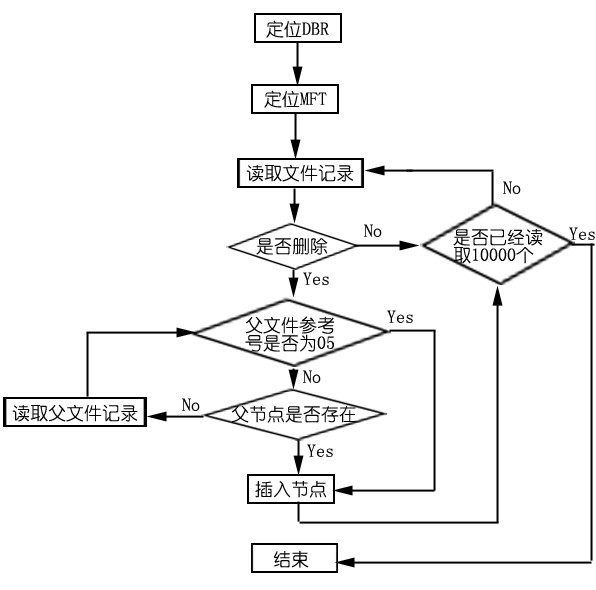

#NTFS文件系统文件恢复

##NTFS文件系统文件删除的分析
在NTFS文件系统下删除文件，有三个地方改变，首先是把这个文件的文件记录中的状态标志改变，文件把01改为00，目录把03改为02，如图所示；然后把索引项删掉，调整B-树；第三个改变的地方就是$Bitmap中对应簇的位由1改为0释放掉簇。数据区并不会改变，所以这才有可能恢复数据。


##NTFS文件系统文件删除后恢复算法及实现
根据文件删除特征，因为索引项会删除，所以根据索引去寻找要删除的文件是不可能的，而在Bitmap中的簇使用情况已经显得没有意义。只有从MFT中的文件记录，算法是：遍历MFT中所有的文件记录，根据其中的删除状态标志判断是否为删除文件，如果是正在使用，则跳过不管；如果是被删除的，则加入要恢复文件的链，由于涉及到目录树的构建，这个节点要放入哪里是一个问题，这时就根据父目录参考号决定放在哪里。目录树的构建，如果找到一个删除的文件或目录记录，这个记录有父目录参考号，查看链表是否有父目录参考号的节点，如果没有，则递归查找这个父目录，直到父目录参考号为05，就是根目录；如果链表中有父目录参考号的节点，则直接插入父目录参考号节点后。具体流程图如下图所示。


编程实现，首先定义一些结构体，用来存储一些文件结构。
NTFS的BPB结构体如下：
```
typedef struct{
	 BYTE NoUsed[11];//为了后面好编程，保留这个Bytes,分别是跳转指令和OEM代号
	 WORD BPBBytesPerSector;			//0x0B 每扇区字节数
	 BYTE BPBSectorsPerClusters;   //0x0D 每簇扇区数
	 BYTE BPBUnused1[2];            //0x0E 保留扇区数
	 BYTE BPBUnused2[3];         //0x10 总为
	 BYTE BPBUnused3[2];         //0x13 未用
	 BYTE BPBMedia;				//0x15 介质描述符
	 BYTE BPBUnused4[2];			//0x16 未用
	 WORD BPBSectorPerTruck;		//0x18 每磁道扇区数
	 WORD BPBNumberOfHeads;		//0x1A 磁头数
	 DWORD BPBHideSector;			//0x1C 隐藏扇区
	 BYTE BPBUnused5[4];			//0x20 保留
	 BYTE BPBUnused6[4];		//0x24 每FAT扇区数
	 DWORD64 BPBTotalSector;				//0x28  扇区总数
	 DWORD64 BPBMFTStartCluster;				//0x30   $MFT 起始簇号
	 DWORD64 BPBMFTMirStartCluster;		//0x38 $MFTMir 起始簇号
	 BYTE BPBFileSize;		//0x40文件记录的大小描述
	 BYTE BPBUnused7[3];			//0x41 未用
	 BYTE BPBIndexBufferSize;			//0x44 索引缓冲区大小描述
	 BYTE BPBUnused8[3];              //45 未用
	 BYTE BPBVolumeName[8];		//0x48 卷序列号
	 BYTE BPBCheckSum[4];		//0x52 校验和
 }NTFSBPB,*PNTFSBPB;
```
NTFS的MFT文件记录头结构体如下：
```
typedef struct{
	 char		MFTHSignature[4];		    //0x00 MFT标志,一定是"FILE"
	 WORD		MFTHUSNOffset;		        //0x04 USN偏移
	 WORD		MFTHUSNSize;		    	//0x06 USN大小与数组
	 LONGLONG	MFTHLSN;	                //0x08 LSN
	 WORD		MFTHSequenceNumber;//0x10 序列号 用于记录主文件表记录被重复使用的次数
	 WORD		MFTHHardLinkCount;//0x12 硬链接数，有多少个目录指向该文件
	 WORD		MFTHFirstAttributeOffset;   //0x14  第一个属性的偏移地址
	 WORD		MFTHFlags;//0x16 标志00文件被删除;01文件正在使用 02目录被删除  03目录正在使用
	 DWORD		MFTHRealRecSize;		    //0x18  文件记录的实际长度
	 DWORD		MFTHAllocatedRecSize;		//0x1C  文件记录的分配长度
	 LONGLONG	MFTHBasicFileRec;		    //0x20  基本文件记录中的文件索引号
	 WORD		MFTHNextAttributeID;		//0x28  下一个属性ID
	 WORD		MFTHBoundary;		        //0x2A  边界
	 DWORD		MFTHReferenceNumber;		//0x2C  文件记录参考号
	 WORD       MFTHUSN;                //0x30  更新序列号
	 BYTE       MFTHUSA[4];                //0x32  更新数组
 }NTFSMFTFILERECHEAD,*PNTFSMFTFILERECHEAD;
```
用于构建文件目录树的结构体如下：
文件链表
```
struct NTFSFILELINK{
	 DWORD64 MFTReferenceNumber;  //文件记录参考号
	 DWORD64 MFTParentReferenceNumber; //父目录文件参考号，使用的时候要注意，只有前个字节是父目录的参考号
	 //可以学着先和xFFFFFFFFFFFF相与，然后再右移位
	 WORD FileFlag; //标志,和MFT中定义的一样,00删除文件,02被删除目录
	 WORD FileName[255];//文件名
	 WORD FileExtend[3];//扩展名
	 DWORD64 FileSize;//文件实际大小
	 DWORD64 AllFileSize; //文件分配大小
	 DWORD64 FileCreateTime;//文件创建时间
	 DWORD64 FileModifyTime;//修改时间
	 NTFSFILELINK *subDir;//子目录指针
	 NTFSFILELINK *Next;//下一个节点指针
 };
//NTFS 文件记录属性，如果是常驻，则RESIDENT，否则NONRESIDENT
 typedef struct	 
 {
	 DWORD	AttibuteType;//0x00  属性类型
	 DWORD	ThisAttributeSize;//0x04  本属性的长度
	 BYTE	IfResident;//0x08 是否为常驻
	 BYTE	AttributeNameLength;//0x09  属性名长度
	 WORD	AttributeNameOffset;//0x0A  属性名的开始偏移
	 WORD	AttributeFlags;//0x0C  标志
	 WORD	AttributeID; //0x0E  属性ID
	 //这里使用联合,sizeof是以最大的为准,如果是小的赋了最大值,后面的忽略就好了
	 union ATTR
	 {
		 //常驻
		 struct RESIDENT
		 {
			 DWORD	AttributeVolumeLength; //0x10  属性体的长度
			 WORD	AttributeVolumeOffset;  //0x14  属性体的开始偏移
			 BYTE	IndexFlags; //0x16  索引标志
			 BYTE	Padding;  //0x17 填充无意义
		 } Resident;
		 //非常驻
		 struct NONRESIDENT
		 {
			 DWORD64	StartVCN;  //0x10 属性体的起始虚拟簇号(VCN)
			 DWORD64	EndVCN; //0x18  属性体的结束虚拟簇号
			 WORD		DatarunOffset; //0x20  Data List偏移地址
			 WORD		CompressionSize; //0x22  压缩单位大小
			 BYTE		Padding[4]; //0x24  无意义
			 DWORD64	AllocSize;//0x28  属性体的分配大小
			 DWORD64	RealSize; //0x30  属性体的实际大小
			 DWORD64	StreamSize;//0x38  属性体的初始大小
			 // data runs...
		 }NonResident;
	 }Attr;
 } NTFSFILERECATTRIBUTE,*PNTFSFILERECATTRIBUTE;
```
首先要完成扫描的工作，看看是否有可以恢复的文件。
第一步打开分区并读取基本信息
```
//先打开分区获取句柄
sprintf_s(tempChar,"\\\\.\\%c:",nDriveChar);
hLogicalDrive=CreateFile(tempChar,GENERIC_READ|GENERIC_WRITE,FILE_SHARE_READ|FILE_SHARE_WRITE,NULL,OPEN_EXISTING,NULL,NULL);
//读取BPB
NTFSBPB theNTFSBPB;
ReadFile(hLogicalDrive,readBuffer,1024,&writeOrReadSize,NULL);
memcpy(&theNTFSBPB,readBuffer,sizeof(theNTFSBPB));
//读取MFT，获取文件记录头
NTFSMFTFILERECHEAD MFTHead;
ReadFile(hLogicalDrive,readBuffer,1024,&writeOrReadSize,NULL);
memcpy(&MFTHead,readBuffer,sizeof(MFTHead));
```
第二步循环读取MFT中的文件记录,固定读取10000个，一般MFT记录占用12%空间，对于大分区，肯定会超过10000个文件记录，但是一般的分区是很难超过10000个文件。
```
for(DWORD64 i=0; i<100000 && pparams->bContinue; i++)
{
	memset(&TempFileLink,0,sizeof(TempFileLink));
	tempReturnValue = AnalyzeAttribute(hLogicalDrive,MFTCustomFileRecStartByte + (__int64)(theNTFSBPB.BPBBytesPerSector*i*2), &TempFileLink, i);
	if (tempReturnValue == -1)
	{
		continue;
	}
	//先判断是不是要加入链表，条件：删除的目录及文件
	if (TempFileLink.FileFlag & 0x01) 
	{	continue;	}
	//新建一个节点，把解析到的数据填进去
	NTFSFILELINK *thisTemp=(NTFSFILELINK *)malloc(sizeof(NTFSFILELINK));
	memcpy(thisTemp,&TempFileLink,sizeof(NTFSFILELINK));
	//下面构建目录树
	InsertNTFSNode(hLogicalDrive, MFTCustomFileRecStartByte -  2*35*(__int64)theNTFSBPB.BPBBytesPerSector,thisTemp);
}
```
在循环当中，用到的关键函数有两个：AnalyzeAttribute(),InsertNTFSNode（）。
其中，AnalyzeAttribute()函数主要是用作解析文件记录属性，并提取关键的文件信息，后面的数据恢复使用到这些关键信息，具体实现如下：
```
//解析属性，完成后填好FileLink信息
//参数：第一个、打开的分区句柄，第二个、这个属性的绝对偏移位置，以字节为单位，第三个、解析的文件结构体，第四个、MFT文件参考号
int AnalyzeAttribute(HANDLE hLogicalDrive, DWORD64 startByte, NTFSFILELINK *pTempFileLink, __int64 ReferenceNumber)
{
	//定义一些临时用到的变量
	NTFSMFTFILERECHEAD MFTHead;
	BYTE readBuffer[1024];
	NTFSBPB theNTFSBPB;
	DWORD writeOrReadSize;
	LARGE_INTEGER filePoint;
	//设置文件指针，对准记录的开始
	filePoint.QuadPart = startByte;
	SetFilePointerEx(hLogicalDrive,filePoint,0,FILE_BEGIN);
	//读取两个扇区内容
	ReadFile(hLogicalDrive,readBuffer,1024,&writeOrReadSize,NULL);
	memcpy(&MFTHead,readBuffer,sizeof(MFTHead)); 
	//判断是不是FILE，不是的就结束For，返回
	if (!strcmp(MFTHead.MFTHSignature,"FILE"))
	{
		return -1;
	}
	//只要排除未删除的文件就可以了，因为后面构建目录使用到目录项
	if (MFTHead.MFTHFlags == 0x01)
	{
		return -1;
	}
	//更新USA
	readBuffer[0x1FE] = readBuffer[0x32];
	readBuffer[0x1FF] = readBuffer[0x33];
	readBuffer[0x3FE] = readBuffer[0x34];
	readBuffer[0x3FF] = readBuffer[0x35];
	DWORD dwMFTPos = MFTHead.MFTHFirstAttributeOffset; //第一个属性的偏移开始遍历
	//要排除未使用的，它的特征是和删除的文件一样的，不过偏移的开始马上是FFFFFFFF了
	if ((readBuffer[dwMFTPos] == 0xFF) && (readBuffer[dwMFTPos+1] == 0xFF) && (readBuffer[dwMFTPos+2] == 0xFF) && (readBuffer[dwMFTPos+3] == 0xFF))
	{
		return -1;
	}
NTFSFILERECATTRIBUTE NTFSAttr;
	pTempFileLink->FileFlag = MFTHead.MFTHFlags;
	do 
	{
		//读取一个属性
		memcpy(&NTFSAttr, &readBuffer[dwMFTPos], sizeof(NTFSFILERECATTRIBUTE));
		//根据属性类型解析数据
		switch(NTFSAttr.AttibuteType)
		{
		//STANDARD INFORMATION
		case STANDARD_INFORMATION:
			NTFSSTANDARDINFORMATION NTFSStdInfo;
			memcpy(&NTFSStdInfo, &readBuffer[dwMFTPos+24], sizeof(NTFSStdInfo));
			pTempFileLink->MFTReferenceNumber = ReferenceNumber + 35; //要加上前面的跳过部分才是现在的，这里出现问题了
			pTempFileLink->FileCreateTime = NTFSStdInfo.FileCreateTime;
			pTempFileLink->FileModifyTime = NTFSStdInfo.FileModifyTime;
			break;
		case FILE_NAME:
			NTFSFILENAME NTFSFilename;
			memcpy(&NTFSFilename, &readBuffer[dwMFTPos+24],sizeof(NTFSFilename));
			//父目录参考号要特别处理
			pTempFileLink->MFTParentReferenceNumber = (NTFSFilename.ParentMFTRefNumber) & 0xFFFFFFFFFFFF;
			pTempFileLink->FileSize = NTFSFilename.FileRealSize;
			pTempFileLink->AllFileSize = NTFSFilename.FileAllocateSize;
			//下面获取文件名
			memcpy(pTempFileLink->FileName, &readBuffer[dwMFTPos+24+66], NTFSFilename.FileNameLength*2);
			break;
			default:
				break;
			}
			//设置好指针，指向下一个属性
			dwMFTPos += NTFSAttr.ThisAttributeSize;
		} while (NTFSAttr.ThisAttributeSize);
		return -1;
}
InsertNTFSNode（）函数则是把解析出来的文件插入到文件链表，如果待插入文件的父文件参考号不是根目录05，则会不断地递归构建目录树，这个函数还用到几个辅助函数不再具体给出，具体实现如下：
//递归把一个节点插入链表
//参数：第一个、打开的分区文件句柄；第二个、文件记录的开始地方，也就是$Mir的开始，单位为Byte；第三个、要插入的文件节点
//返回值:如果插入节点成功，则返回TRUE，否则返回FALSE
BOOL InsertNTFSNode(HANDLE hDrive, DWORD64 StartByte,NTFSFILELINK *thisTemp)
{
	//如果已经存在的节点，就返回啦
	 if(TraverseToFindRefNum(theAllNTFSFileLink, thisTemp->MFTReferenceNumber) != NULL)
	 {	return FALSE;  }
	//先找到链表根目录的最后一个节点，便于后面的插入操作
	NTFSFILELINK *RootLast = theAllNTFSFileLink;
	while ((RootLast != NULL) && (RootLast->Next != NULL))
	{
		RootLast = RootLast->Next;
	}
	//首先判断这个节点的父目录是不是根目录，如果是，直接加插入文件链表
	if (thisTemp->MFTParentReferenceNumber == 5)
	{
		if (theAllNTFSFileLink == NULL)
		{
			theAllNTFSFileLink = thisTemp;
			RootLast = thisTemp;
		}
		else
		{
			RootLast->Next = thisTemp;
			RootLast = RootLast->Next; //要向下移动一个
		}
		return TRUE;
	}

	//如果不是根目录则要一直往上遍历，直到根目录，然后执行插入
	//先看看目录是否存在，根据父目录参考号和链表中的本目录中的参考号
	NTFSFILELINK *tempNode=NULL;
	if((tempNode = TraverseToFindRefNum(theAllNTFSFileLink,thisTemp->MFTParentReferenceNumber)) != NULL)
	{
		//说明已经存在了，但是是文件的话，就插入到根目录中去
		if (RootLast!=NULL && (tempNode->FileFlag == 0x00) && (tempNode->FileFlag == 0x01))
		{
			RootLast->Next = thisTemp;
			RootLast = RootLast->Next;
		}
		else
		{
			//插入到父目录中，父目录的指针tempNode
			if (tempNode->subDir == NULL)
			{
				tempNode->subDir = thisTemp;
			}
			else
			{
				NTFSFILELINK *youyiTemp = tempNode->subDir;
				//找到最后一个节点
				while (youyiTemp->Next != NULL)
				{
					youyiTemp = youyiTemp->Next;
				}
				youyiTemp->Next = thisTemp;
			}
		}
	}
	else
	{
		//如果没找到，读取这个属性，然后在递归查找
		NTFSFILELINK *pTempParentDir = (NTFSFILELINK *)malloc(sizeof(NTFSFILELINK));
		memset(pTempParentDir,0,sizeof(NTFSFILELINK));
		//如果读取属性失败或者是这个记录是文件，直接插到根目录中去
		if((AnalyzeAttribute(hDrive, StartByte+thisTemp->MFTParentReferenceNumber*1024,pTempParentDir,thisTemp->MFTParentReferenceNumber) == -1) || 
			pTempParentDir->FileFlag == 0x00 || pTempParentDir->FileFlag == 0x01 )
		{
			RootLast->Next = thisTemp;
			RootLast = RootLast->Next; //要向下移动一个
		}
		else
		{
			//如果这个节点建立成功之后，把上一个接到这个节点之后，然后递归
			pTempParentDir->subDir = thisTemp;
			InsertNTFSNode(hDrive, StartByte, pTempParentDir);
		}
	}
	return TRUE;
}
```
扫描完之后就是文件的恢复了，算法：因为前面的扫描已经获取了在MFT哪个记录存在可以恢复的文件，即知道了文件的参考号，只要定位到这个文件记录，解析属性再读取数据保存为一个新文件即可，流程图如下图所示。


在主界面选择好恢复的文件并点击恢复按钮之后，会在后台启动一个线程，因为恢复的时间可能过程，不能让主界面卡主。线程使用到的函数是RecoveryNTFSDataUnFormatThread()，这个函数主要实现文件恢复，首先读取BPB定位MFT，然后使用For循环遍历ListView，看哪个文件被选中，选中的则执行恢复操作，代码如下：
```
//遍历ListView，看选中哪个文件
for(int i=0; i<n && pparams->bContinue; i++)
{
	//……省略前面一部分代码
	//判断是不是常驻属性，分两种情况处理
if (tempAttr.IfResident)
	{
		//非常驻，解析出一个RunList链表
		DataRunListLink *tempDataRun=NULL;
		tempDataRun = ExtraDataRunList(&readBuffer[curPos+tempAttr.Attr.NonResident.DatarunOffset], tempAttr.ThisAttributeSize-tempAttr.Attr.NonResident.DatarunOffset);
		//如果解析RunList失败，则恢复失败，不管这个文件了
		if (tempDataRun == NULL)
		{	continue;	}
		//根据链表读取数据,在H属性中有文件的实际大小，可以使用这个
		__int64 lastStartCluster = 0;
		__int64 WriteByte = 0;
		DWORD willBeWriteByte = 0;
		DWORD BytesPerCluster = theNTFSBPB.BPBBytesPerSector *theNTFSBPB.BPBSectorsPerClusters;
		BYTE *ClusterBuffer = (BYTE *)malloc(BytesPerCluster);
		while((tempDataRun!=NULL) && pparams->bContinue)
		{
			for(DWORD n=0; (n<tempDataRun->Size)&&pparams->bContinue ; n++)
			{
	//设置文件指针，每簇读取
	FilePoint.QuadPart = (__int64)((lastStartCluster + tempDataRun->startCluster + n) * theNTFSBPB.BPBSectorsPerClusters) * (__int64)theNTFSBPB.BPBBytesPerSector;
	SetFilePointerEx(hLogicalDrive,FilePoint,0,FILE_BEGIN);
ReadFile(hLogicalDrive,ClusterBuffer,BytesPerCluster,&writeOrReadSize,NULL);
	if ((WriteByte+BytesPerCluster) > tempAttr.Attr.NonResident.RealSize)
	{
		willBeWriteByte = (tempAttr.Attr.NonResident.RealSize) % BytesPerCluster;
	}
	else
	{
		willBeWriteByte = BytesPerCluster;
	}
	WriteFile(hFile,ClusterBuffer,willBeWriteByte,& writeOrReadSize,NULL);
	WriteByte += writeOrReadSize;
	}
	lastStartCluster += tempDataRun->startCluster;
	tempDataRun=tempDataRun->Next;
	}
	free(ClusterBuffer);
	}
	else
	{
	//常驻，直接把80H中的属性写入文件
WriteFile(hFile,&readBuffer[curPos+tempAttr.Attr.Resident.AttributeVolumeOffset], tempAttr.Attr.Resident.AttributeVolumeLength,& writeOrReadSize,NULL);
	}
	CloseHandle(hFile);
	}
}
上面的函数使用到一个关键的辅助函数，解析RunList的函数ExtraDataRunList（）。
//解析DataRun
//参数:第一个、读取出来的Run List数据；第二个、Run List大小
//返回值:解析出的Run List链表
DataRunListLink * ExtraDataRunList(BYTE *readBuffer, DWORD nSize)
{
	DataRunListLink *RunList = NULL;
	DataRunListLink *lastNode=NULL;
	BYTE LenAndOffSet; //压缩字节，起始簇号和簇数的偏移
	BYTE length; //簇数偏移字节
	BYTE Offset;//起始簇号偏移字节
	__int64 startCluster;
	__int64 NumOfClusters;
	DWORD curPos=0;
	for (;;)
	{
		LenAndOffSet=0;
		memcpy(&LenAndOffSet, &readBuffer[curPos],sizeof(BYTE));
		curPos+=sizeof(BYTE);
		//已经遍历完Run List了,特征是为
		if (!LenAndOffSet)
		{	break;	}
		//获取低位,即簇数占用的字节
		length = LenAndOffSet & 0x0F;
		//获取高位,然后右移,得到起始簇号占用的字节
		Offset = (LenAndOffSet & 0xF0) >> 4;
		//读取真正的簇数
		NumOfClusters=0;
		memcpy(&NumOfClusters,&readBuffer[curPos],length);
		curPos+=length;
		//读取真正的起始簇号
		startCluster = 0;
		memcpy(&startCluster, &readBuffer[curPos],Offset);
		curPos+=Offset;
		// 如果起始簇号的最高位是,则要取反加,因为这是带符号数的
		//if中千方百计要取得最高位，就是按照顺序的最后一个BYTE，所以先取地址，然后再取数据，好东西，再和x80相与看最高位是不是，如果是进入For循环
		if((((char*)&startCluster)[Offset-1])&0x80)
		{
			//取反加一
			for(int i=sizeof(LONGLONG)-1;i>(startCluster-1);i--)
				((char*)&startCluster)[i] = 0xff;
		}
		//解析完毕,新建一个节点把这些参数放进去
		DataRunListLink *temp = (DataRunListLink *)malloc(sizeof(DataRunListLink));
		temp->Size = NumOfClusters;
		temp->startCluster = startCluster;
		temp->Next = NULL;
		//把节点插入链表最后
		if (RunList == NULL)
		{
			RunList = temp;
			lastNode = temp;
		}
		else
		{
			lastNode->Next = temp;
			lastNode = lastNode->Next;
		}
	}
	return RunList;
}
```
至此，文件恢复的算法基本完成，当然正在编程的时候还要辅助界面设计、人性化操作提示等，需要其他很多的编程。

##NTFS文件系统格式化分区的分析
NTFS文件系统格式化分为两种模式：快速格式化和一般格式化。快速格式化就是新创建一个文件系统，其中，$MFT是重新初始化，相当于原来的MFT记录全没了，但是它不会把整个分区的数据擦除，只会改变文件系统所用到的部分。一般格式化不同的操作系统会采取不一样的操作，Windows XP则和快速格式化一样，直接重新建立文件系统；Windows 7操作系统则先把分区全部擦除，填充0，再重新建立文件系统，这种情况下原来的MFT记录、索引、数据全没了。

##NTFS文件系统格式化分区后的恢复
快速格式化只是擦除了分区的MFT文件记录，原来的索引项和数据区并没有擦除，但是关于文件内容的记录只在MFT文件记录有，索引项并不会记录文件内容的任何信息，所以MFT文件记录一旦擦除了，是没有办法找到文件内容了。有些数据恢复软件可以扫描出文件，但是这些只是从索引里面找到的文件概况，试图恢复是不会成功的，因为最根本的MFT文件记录已经被删除了。一般格式化就更不用说了，连数据区都擦除了，是没办法恢复了。
但是在程序中，格式化恢复同样调用删除恢复的野蛮扫描算法，期待奇迹的出现。
