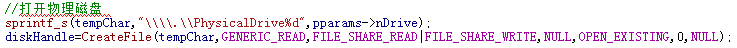
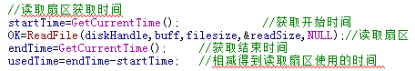
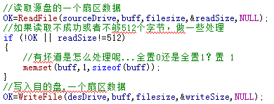

#数据恢复

## 数据恢复的背景与意义
数据恢复技术就是对计算机系统遭受误操作、病毒侵袭、硬件故障、黑客攻击等事件后，将用户的数据从各种“无法读取”的存储设备中拯救出来，从而将损失降到最低。随着计算机的普及，不管是政府、军队、企业或者个人，都严重依赖计算机，并把机密文件、重要数据存储在计算机内，信息的安全受到很大挑战。正是数据恢复技术在构筑数据安全保的最后一道防线，使数据恢复的重要性越来越被关注。据IDC最新研究显示：仅在2011年，全球数据产生量达1.8ZB(1.8万亿GB)，相当于在中国每个人每分钟写1条微博，也要18675年，而且数据正在以爆炸式增长，未来十年，全球数据存储量将增长50倍，可见数据是海量的。在这么多数据中，有很多重要的。政府的机密文件如果被窃取，泄露国家机密，危害着国家的稳定和安全；企业的数据泄露可能造成倒闭，数据丢失可能造成惨重的损失；个人也面临无缘无故丢失数据的可能，造成工作不能正常进行，或者珍贵的照片不见，或者是个人的私密泄露，这都是有前车之鉴的。此时数据恢复显得尤其重要，数据恢复技术就是在这样的大背景下应运而生。
  
数据恢复在计算机取证技术中有重要的意义，利用计算机犯罪，作案的同时，犯罪嫌疑人尽管抹去数据，或多或少都会留下蛛丝马迹。在一定的条件下，取证人员可以利用数据恢复技术恢复这些证据。

世界著名的权威研究机构WestWorld公司在报告中指出：100M的核心数据价值超过100万美元；每500个数据中心一年中就有一个要经历一次灾难，其中29%的公司因此倒闭。可见数据恢复的重要性，而且是不能用金钱衡量的，同时数据恢复产业规模将不断扩大。

## 数据恢复研究现状
数据恢复的核心技术主要在于国外，特别是美国和俄罗斯，国内公司的技术和国外的技术根本不在同一级别。有资料显示，美国军方可以恢复覆盖6~9次的数据，俄罗斯可以恢复3~4次的覆盖，IBM自己耗资6亿美元的研究成果可以恢复覆盖2~3次的数据，由于这些技术涉及到国家的机密和商业利益，是不会公布的。

国内的数据恢复行业觉悟比较晚，输在了起跑线上。国内主要是以小公司为主，而且大部分是拿别人的软件或技术来做研究，没有自己的核心技术，在各大电脑城或者网站都是作坊式的数据恢复。由于微软开发的NTFS文件系统技术上是保密，所以更难发展。目前，国内这方面研究处于领先地位的是以戴士剑先生为代表的军方研究所和以涂彦晖为代表的国内公司。

尽管数据恢复行业落后，但是对人才的需求是很多的，而且人才短缺或者说基本上没有，国内的教育跟不上发展是一个很重要的原因，所以培养这方面的人才势在必行。

# 硬盘构造及恢复方法


## 硬盘的结构

### 硬盘的物理结构
硬盘主要由盘片、磁头及定位驱动系统、主轴系统和控制电路四部分组成。

盘片：盘片由较轻质的金属或玻璃制成，表面再涂上一层磁性材料，它拥有最高精度的光滑表面。为了防止磁头和盘片刮伤，在盘片的表面覆盖了由真空沉积工艺生成的氧化铬或钴。盘片的光洁度极高，硬盘都是密封的，内部非常干净，哪怕是一丝肉眼看不见的灰尘也会给盘面带来致命的损伤。现在的盘片使用垂直记录技术，在一定的面积内比水平记录技术存储的数据多很多。目前的商用硬盘技术已经达到了单碟1TB，以希捷、日立、西部数据三巨头为主导。

磁头及定位驱动系统：磁头顾名思义就是对盘片数据进行读写，每个盘片有正反两面，每个面有一个磁头负责，磁头是硬盘中最昂贵最精密的部分。磁头安装在磁头支架上，它们像梳子的齿一样伸进各自负责的盘片间隔中。磁头支架在定位电机驱动下，可以使磁头在盘片上不同的地方来回移动。盘片在高速旋转时会带动盘表面的空气，空气作用在磁头上产生一个浮力使磁头与盘面保持一个极微小的距离，这样既可有效进行读写，也不会磨损盘面。

主轴系统：主轴系统就是主轴电机，由电机组成，驱动盘片高速旋转。主流磁盘转速有5400rpm、7200rpm。盘片转的越快，读取速度越快，但是更容易损坏，使用过程中尽量避免碰撞。

控制电路：在硬盘上的电路板及元件。主要控制数据的读写，磁头的定位等。
### 硬盘的逻辑结构
硬盘的盘片在逻辑上由柱面、磁道、扇区组成。

磁道（Track）：硬盘在出厂前，厂家都会对硬盘进行低级格式化。低格就是在盘片上划分许多同心圆，这些同心圆叫做磁道，信息就存储在磁道，磁道之间是有间隔的。每个盘片有成千上万个磁道，为了便于管理，每个磁道都有一个编号，从外到内自0开始顺序编号。

扇区（Sector）：每个磁道上又划分为很多段，每一段是一个扇区，像扇子一样的圆弧。一般每个磁道包含63个扇区。每个扇区也有自己的编号，从1到63。

柱面（Cylinder）：指各个盘面上编号相同的磁道构成的整体。如有三个盘片，每个盘面上0号磁道构成的整体叫一个柱面。

盘片有编号，磁头也有逻辑编号，逻辑上按照从上到下自0开始依次编号。
### 硬盘的逻辑C/H/S
硬盘是通过磁头、柱面、扇区进行寻址的，就是所谓的C/H/S。要从磁盘上定位一个数据，就要为这个数据编号，磁头号负责定位哪个盘面，柱面定位磁道，扇区定位对应的扇区，这样就可以唯一确定地址了。由于系统的限制，逻辑C/H/S的起始值为0/0/1，最大取值为1023/254/63，所以逻辑C/H/S能够管理的柱面、磁头、扇区分别为1024、255、63，这样就可以算出逻辑C/H/S能管理的扇区总数为1024*255*63=16450560，大约为8GB，这也是逻辑C/H/S能管理的最大空间。后文分析FAT32及NTFS文件系统会遇到C/H/S参数，但现在的系统对C/H/S参数已经是忽略了。
### 硬盘的LBA
LBA（Logic Block Address）即扇区逻辑块地址。由于C/H/S的限制，引入了LBA的概念。LBA把所有的物理扇区都按照某种规则看做是一线性编号的扇区，即从0到最大值，形成一条直线，这样使用唯一的编号就可以确定数据的物理扇区。LBA最初定义的是28位地址，只能管理137GB的硬盘，然而由于硬盘的容量增长到28位已经不能满足需求。T13组织提出的48位标准，使逻辑扇区地址达到了281474976710655，即144PB（1PB=1000 000GB）。现在的硬盘都是以LBA编址。
## 数据恢复方法
数据可能在多种情况下丢失，比如物理硬盘的故障、无可抗拒的自然灾害、病毒的损坏、黑客入侵、误操作等。根据不同的情况分为两种方法。

### 物理恢复
在硬盘出现物理故障情况，如磁头的损坏、磁组变形、盘片划伤、硬盘产生坏道、电机损坏、控制电路损坏、磁盘异响等情况下应该立即停止使用，防止数据的进一步丢失，这种情况下要对硬盘维修后再进行数据恢复。一般是进行开盘数据恢复，开盘就是在洁净度有保障的环境下打开硬盘外壳，对其盘腔内部进行操作。物理恢复对环境和技术的要求非常高，专业数据恢复公司都有洁净间，恢复的几率也比较大，但是费用昂贵。

### 逻辑恢复
逻辑恢复就是在没有出现物理故障，仅仅是数据的丢失。逻辑恢复可以通过软件的方式进行数据修复，整个过程不涉及硬件的维修。而导致数据丢失的原因往往是误删除，误格式化，误分区，病毒感染，黑客攻击恶意删除等。硬盘出现逻辑故障一般表现为：文件丢失、分区丢失、无法进入操作系统、无法读取文件等。造成逻辑数据丢失的原因是十分复杂的，一般的数据恢复软件只针对特定情况设计算法，所以恢复的效果是非常差的，要真正恢复只有人工分析数据。一般情况下，只要数据区没有被覆盖，数据的恢复效果是很理想的。

## 恢复前的准备工作
在恢复数据之前，对硬盘情况的了解是十分必要的，如果盲目操作只会造成数据彻底丢失。首先要了解检查是否有物理故障，然后对物理故障进行修复。之后要对源数据硬盘进行备份到另外一个硬盘上进行恢复，不在源盘上进行操作，防止数据的进一步丢失。恢复之前也可以进行硬盘的坏道检测，因为坏道很容易造成数据丢失。

### 坏道检测
硬盘坏道可以分为逻辑坏道和物理坏道。逻辑坏道是由于软件或使用不当造成文件系统的损坏，这种情况下重新格式化分区就可以解决问题。物理坏道是硬盘盘片磁介质出问题，造成某些扇区无法读写，这种坏道不能修复，只能使用软件屏蔽掉坏道。出现坏道的症状一般有系统无故死机、蓝屏，无法启动，读取文件时间久或者根本无法读取文件。

针对硬盘的坏道，编程实现了坏道检测。坏道检测原理根据扇区的读取时间判断，一般扇区读取时间是在3ms以内，一直到150ms都是正常情况，大于150ms就很危险了，很容易形成坏道，如果扇区读取失败就说明是坏道。只要一个扇区出现问题，整个磁道都不能使用了，所以叫坏道。

在windows系统中，有API函数读取文件 -- ReadFile，系统可以把物理硬盘当做一个文件来读取，所以能检测整个硬盘。算法为：使用CreateFile函数打开要检测的物理磁盘，然后获取当前的系统时间，使用ReadFile函数读取一个扇区，如果ReadFile 的返回值是错误，则可以判断整个扇区是出现坏道的，读取完后再获取当前系统时间，用后面的时间减去前面的时间得到读取整个扇区的时间，最后根据时间判断扇区的情况。关键代码如下：




上图的代码中坏道检测是从开始位置直接遍历整个磁盘来判断是否出现坏道。而实际上可以采用多线程技术对其进行实现。譬如两个线程同时对磁盘进行遍历，一个线程从磁盘0号位置开始，一个线程从磁盘中间位置开始。这样的处理大大减短了对磁盘遍历检测坏道的时间。

### 磁盘克隆
为了防止进一步的数据丢失，首先要把数据复制到另外一个硬盘上再操作。磁盘克隆是基于整个硬盘的数据复制，把01比特按原样照搬，而不理会数据的意义。这区别于文件级的数据复制，文件的复制是基于有意义的文件系统数据，不会对MBR，DBR和一些隐藏的文件进行复制，所以磁盘的克隆是很有必要的。

磁盘克隆的原理也很简单。要复制的硬盘叫源盘，存放复制的数据是目的盘。算法：首先使用ReadFile打开源盘和目的盘，源盘从0扇区开始读取，每读取一个扇区就按照扇区序号写入目的盘，读取源盘的同时也获取计算读取时间，发现读取失败的说明源盘有坏道，这时在目的盘的对应扇区使用全1数据填充，这样就可以最大程度保留源盘的数据，造成数据丢失的也是这个扇区而已，对其他扇区不会有影响。关键代码如下：



针对磁盘克隆也有一种改进方法：最简单最直观的实现是将数据从源地址读取出来然后写进目的地址。在这过程中并没有考虑目的地址原有的数据是否有与源地址重合的部分。也就是说，原本的实现需要对目的盘完完整整地进行一遍写操作。而改进的方法如下：
首先，将目的地址的数据与源地址的数据进行一次异或操作，比如说A是源地址，B是目标地址，temp是得到的中间结果。
```
A:   100011001110
B:   001101101001
temp:101110100111
```
temp中为1的位即A、B相同bit位的数据不一致，而根据temp中得到的结果，对B地址中temp对应位为1的位进行取反操作，即完成了将A中的数据拷贝至B，相较于直接进行读写拷贝，这样的方式最大程度上保留了B地址中不需进行变更的数据，加快了磁盘克隆操作所需的时间。
